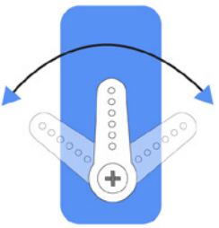

# SunFounder PiCar-X

PiCar-X 是一款基于 Raspberry Pi 平台的 AI 驱动自驾机器人小车，其中 Raspberry Pi 作为控制中心。 PiCar-X 配备了双轴摄像头模块、超声波模块和巡线模块，支持色彩/人脸/交通标志识别、自动避障、自动巡线等功能。

## 组装 PiCar-X

在组装 PiCar-X 之前，请先确认所有部件和组件是否齐全。如果发现有缺失或损坏的部件，请立即通过 [service@sunfounder.com](mailto:service%40sunfounder.com) 联系 SunFounder，以尽快解决问题。

> **下载组装说明书**
>
> 纸质版组装说明书会根据需求定期更新，您可以在说明书右上角查看版本号。如果您丢失了纸质说明书，或者更喜欢 PDF 版本，可以通过以下链接下载相应版本。
>
> [`Picar-X Kit 装配折页`](_downloads/6200e890a95abf1039a3909264e07279/PICAR-X_assemble.pdf)

## 安装Raspbarry Pi OS 操作系统

### 1. 快速入门

搭建 Raspberry Pi 环境：

#### 安装树莓派操作系统并配置 Wi-Fi（推荐使用电脑热点2.4GHz）

参考教程：[https://shumeipai.nxez.com/2024/04/23/install-the-operating-system-for-the-raspberry-pi.html](https://shumeipai.nxez.com/2024/04/23/install-the-operating-system-for-the-raspberry-pi.html)
并启用远程访问（ssh）

```bash
ssh username@ip
```

建议搭配FTP进行文件传输（filezilla/mobasterm

#### 安装所有模块（重要）

1. **准备系统**确保你的 Raspberry Pi 已连接到互联网，然后更新系统：

   ```bash
   sudo apt update
   sudo apt upgrade
   ```

   备注
   如果你使用的是 Raspberry Pi OS Lite，请先安装所需的 Python 3 软件包：
   ```bash
   sudo apt install git python3-pip python3-setuptools python3-smbus
   ```
2. **安装 robot-hat**下载并安装 `robot-hat` 模块：

   ```bash
   cd ~/
   git clone -b 2.5.x https://github.com/sunfounder/robot-hat.git --depth 1
   cd robot-hat
   sudo python3 install.py
   ```

   *当无法连接到github时，可使用gitee替代：(可能出现voice-assistant库安装不成功的提示，对本课程不影响）*
   ```bash
   cd ~/
   git clone -b 2.5.x https://gitee.com/du-hao-yang/robot-hat.git --depth 1
   cd robot-hat
   sudo python3 install.py
   ```
3. **安装 vilib**下载并安装 `vilib` 模块：

   ```bash
   cd ~/
   git clone https://github.com/sunfounder/vilib.git --depth 1
   cd vilib
   sudo python3 install.py
   ```

   *当无法连接到github时，可使用gitee替代：*
   ```bash
   cd ~/
   git clone https://gitee.com/du-hao-yang/vilib.git --depth 1
   cd vilib
   sudo python3 install.py
   ```
4. **安装 picar-x**下载并安装 `picar-x` 模块：

   ```bash
   cd ~/
   git clone -b 2.1.x https://github.com/sunfounder/picar-x.git --depth 1
   cd picar-x
   sudo pip3 install . --break
   ```

   *当无法连接到github时，可使用gitee替代：*
   ```bash
   cd ~/
   git clone -b 2.1.x https://gitee.com/du-hao-yang/picar-x.git --depth 1
   cd picar-x
   sudo pip3 install . --break
   ```

   此步骤可能需要一些时间，请耐心等待。
5. **启用声音（I2S 功放）**
   为了启用音频输出，请运行 `i2samp.sh` 脚本以安装所需的 I2S 功放组件：

   ```bash
   cd ~/robot-hat
   sudo bash i2samp.sh
   ```

   按照屏幕提示操作，输入 `y` 并按 Enter 继续，如果重启后仍然没有声音，请尝试多次运行 `i2samp.sh` 脚本。

#### 舵机校准（重要）

舵机的角度范围为 -90°~90°，但出厂时舵机的初始角度是随机的，可能是 0°，也可能是 45°。 如果在这种情况下直接进行安装，当机器人运行程序后会出现动作混乱的情况，严重时甚至可能导致舵机卡死并烧毁。

因此，在安装之前，我们需要先将所有舵机的角度统一设置为 **0°**，这样无论舵机向哪个方向转动，其初始位置都在中间。

1. 为了确认舵机已经正确设置为 0°，请先将舵机臂插到舵机轴上，然后轻轻转动舵机臂到其他角度。这样做只是为了让你能够清楚地看到舵机是否在转动。
2. 接下来，运行 `example/` 文件夹中的 `servo_zeroing.py`。
   ```bash
   cd ~/picar-x/example
   sudo python3 servo_zeroing.py
   ```
3. 然后，按照下图所示，将舵机线插入 P11 接口。此时你会看到舵机臂转动到某个位置（这就是 0° 位置，该位置是随机的，可能不是完全垂直或平行）。
4. 现在，取下舵机臂，保持舵机线仍然连接，并且 **不要关闭电源**。随后按照纸质说明继续完成组装。

备注

- 在使用螺丝固定舵机之前，请不要拔掉舵机线；固定完成后可以再拔掉。
- 舵机通电时请勿手动旋转舵机，以免造成损坏；如果舵机轴插入角度不正确，请将舵机取下并重新插入。
- 在安装每一个舵机之前，都需要先将舵机线插入 P11 接口并接通电源，将舵机角度设置为 0°。

### 2. 基础运动控制

在组装完成你的 PiCar-X 之后，从简单的运动程序开始。 本部分将教你如何控制电机，实现前进、后退、转弯，并使用基础传感器完成避障、循迹等功能。

#### 1. 校准 PiCar-X

##### 校准电机和舵机

由于 PiCar-X 安装过程中可能存在偏差，或者舵机本身存在局限性，某些舵机角度可能会稍有倾斜， 因此可以对其进行校准。

当然，如果您认为安装非常完美且无需校准，可以跳过本章。

1. 运行 `calibration.py`。
   ```bash
   cd ~/picar-x/example
   sudo python3 1.cali_servo_motor.py
   ```
2. 运行代码后，终端会显示以下界面：
3. 按 `R` 键测试 3 个舵机是否正常工作。
4. 按数字键 `1` 选择前轮舵机，然后按 `W/S` 键调整前轮方向，使其尽量保持正前方且不偏左或偏右。
5. 按数字键 `2` 选择 **水平舵机**，然后按 `W/S` 键调整云台水平，使其正对前方且不倾斜左右。
6. 按数字键 `3` 选择 **俯仰舵机**，然后按 `W/S` 键调整云台俯仰角度，使其正对前方且不向上或向下倾斜。
7. 如果在安装过程中电机接线发生了反转，您可以按 `E` 键测试小车是否可以正常向前移动。如果不能，使用数字键 `4` 和 `5` 选择左右电机，然后按 `Q` 键校准旋转方向。
8. 校准完成后，按 `空格键` 保存校准参数。根据提示输入 `y` 确认，最后按 `Ctrl+C` 退出程序完成校准。

##### 校准灰度模块

由于环境条件和光线情况的不同，灰度模块的预设参数可能无法达到最佳效果。 通过此程序，您可以对参数进行微调以获得更好的性能。

1. 在浅色地板上贴一条约 15 厘米长的黑色电工胶带。将 PiCar-X 放置在胶带上，使其跨越胶带。此时，灰度模块的中间传感器应正对胶带，而两侧传感器应悬空在浅色地面上。
2. 运行代码。
   ```bash
   cd ~/picar-x/example
   sudo python3 1.cali_grayscale.py
   ```
3. 运行代码后，终端会显示以下界面：
4. 按 `Q` 键开始灰度校准。您会看到 PiCar-X 轻微向左和向右移动。在此过程中，三个传感器应至少一次扫过电工胶带。
5. 在 “threshold value” 区域，您将看到三组明显不同的数值，而 “line reference” 将显示两组中间值，分别表示每组数值的平均值。
6. 接下来，将 PiCar-X 悬空（或放置在悬崖边缘）并按下 `E` 键，您会发现 “cliff reference” 的值也会相应更新。
7. 确认所有数值准确无误后，按 `空格键` 保存数据。然后按 `Ctrl+C` 退出程序。

#### 2. 视频小车

此程序为您提供 PiCar-X 的第一视角体验！通过键盘上的 WSAD 键控制方向， 使用 O 和 P 键调整速度。

**运行代码**

```bash
cd ~/picar-x/example
sudo python3 11.video_car.py
```

代码运行后，您可以看到 PiCar-X 拍摄的画面，并通过以下按键进行控制：

- O: 加速
- P: 减速
- W: 前进
- S: 后退
- A: 左转
- D: 右转
- F: 停止
- T: 拍照
- Ctrl+C: 退出

**查看画面**

代码运行后，终端将显示以下提示：

```text
No desktop !
* Serving Flask app "vilib.vilib" (lazy loading)
* Environment: production
WARNING: Do not use the development server in a production environment.
Use a production WSGI server instead.
* Debug mode: off
* Running on http://0.0.0.0:9000/ (Press CTRL+C to quit)
```

然后您可以在浏览器中输入 `http://<你的IP>:9000/mjpg` 查看视频画面，例如： `https://192.168.18.113:9000/mjpg`


**代码**

```python
#!/usr/bin/env python3
from picarx.utils import reset_mcu
from picarx import Picarx
from vilib import Vilib
from time import sleep, time, strftime, localtime
import readchar
import os
user = os.getlogin()
user_home = os.path.expanduser(f'~{user}')
reset_mcu()
sleep(0.2)
manual = '''
按下键盘按键以调用功能（不区分大小写）：
    O: 加速
    P: 减速
    W: 前进
    S: 后退
    A: 左转
    D: 右转
    F: 停止
    T: 拍照
    Ctrl+C: 退出
'''

px = Picarx()
def take_photo():
    _time = strftime('%Y-%m-%d-%H-%M-%S',localtime(time()))
    name = 'photo_%s'%_time
    path = f"{user_home}/Pictures/picar-x/"
    Vilib.take_photo(name, path)
    print('\nphoto save as %s%s.jpg'%(path,name))

def move(operate:str, speed):
    if operate == 'stop':
        px.stop()
    else:
        if operate == 'forward':
            px.set_dir_servo_angle(0)
            px.forward(speed)
        elif operate == 'backward':
            px.set_dir_servo_angle(0)
            px.backward(speed)
        elif operate == 'turn left':
            px.set_dir_servo_angle(-30)
            px.forward(speed)
        elif operate == 'turn right':
            px.set_dir_servo_angle(30)
            px.forward(speed)

def main():
    speed = 0
    status = 'stop'
    Vilib.camera_start(vflip=False,hflip=False)
    Vilib.display(local=True,web=True)
    sleep(2)  # 等待启动
    print(manual)
    while True:
        print("\rstatus: %s , speed: %s    "%(status, speed), end='', flush=True)
        # 读取按键
        key = readchar.readkey().lower()
        # 操作处理
        if key in ('wsadfop'):
            # 油门
            if key == 'o':
                if speed <=90:
                    speed += 10
            elif key == 'p':
                if speed >=10:
                    speed -= 10
                if speed == 0:
                    status = 'stop'
            # 方向控制
            elif key in ('wsad'):
                if speed == 0:
                    speed = 10
                if key == 'w':
                    # 倒车时限速，避免瞬间电流过大
                    if status != 'forward' and speed > 60:
                        speed = 60
                    status = 'forward'
                elif key == 'a':
                    status = 'turn left'
                elif key == 's':
                    if status != 'backward' and speed > 60: # 倒车时限速
                        speed = 60
                    status = 'backward'
                elif key == 'd':
                    status = 'turn right'
            # 停止
            elif key == 'f':
                status = 'stop'
            # 移动
            move(status, speed)
        # 拍照
        elif key == 't':
            take_photo()
        # 退出
        elif key == readchar.key.CTRL_C:
            print('\nquit ...')
            px.stop()
            Vilib.camera_close()
            break
        sleep(0.1)

if __name__ == "__main__":
    try:
        main()
    except Exception as e:
        print("error:%s"%e)
    finally:
        px.stop()
        Vilib.camera_close()
```
#### 3. 实验第一问：路口模型

Pico2Wave 生成的声音更加自然，接近人声。 它的使用更简单，但灵活性较低 —— 只能设置语言，不能调节语速或音高。

**步骤如下**：

-   创建一个新文件：   
    ```bash
    cd ~/picar-x/example
    sudo nano follow.py
    ```
-   将以下代码复制进去。按 `Ctrl+X` → `Y` → `Enter` 保存并退出。   
```python
from picarx import Picarx
import time

POWER = 50

# 新的距离阈值（单位：cm）
FAR_DISTANCE = 65   # >100 全速前进
MID_DISTANCE = 15    # 100-50 按比例前进
STOP_DISTANCE = 10   # 50-40 停止；<40 按比例倒退

def main():
    try:
        px = Picarx()
        # px = Picarx(ultrasonic_pins=['D2','D3']) # trigger, echo

        # 转向舵机回正，直行
        px.set_dir_servo_angle(0)

        while True:
            distance = px.ultrasonic.read()
            if distance is None:
                # 读数异常，直接停一次并继续
                px.forward(0)
                continue

            distance = round(distance, 2)
            speed = 0

            if distance > FAR_DISTANCE:
                # 全速前进
                speed = POWER
                px.forward(min(max(int(speed), 0), POWER))
            elif distance > MID_DISTANCE:
                # 100-50：按比例缩小 POWER（线性映射 50->0, 100->POWER）
                ratio = (distance - MID_DISTANCE) / (FAR_DISTANCE - MID_DISTANCE)  # 0..1
                speed = POWER * ratio
                px.forward(min(max(int(speed), 0), POWER))
            elif distance >= STOP_DISTANCE:
                # 50-40：静止
                px.forward(0)
            else:
                # 40-0：按比例倒退（40->0, 0->POWER）
                ratio = (STOP_DISTANCE - max(distance, 0)) / STOP_DISTANCE       # 0..1
                speed = POWER * ratio
                px.backward(min(max(int(speed), 0), POWER))

            print(f"distance: {distance} cm, speed: {int(speed)}, state: "
                  f"{'FWD' if distance > STOP_DISTANCE else ('STOP' if distance >= STOP_DISTANCE else 'BWD')}")

            # 适当放慢循环，稳定控制
            time.sleep(0.02)

    finally:
        # 退出前停车
        px.forward(0)


if __name__ == "__main__":
    main()
    ```
-   运行程序：   
    ```bash
    sudo python3 follow.py
    ```

* * *